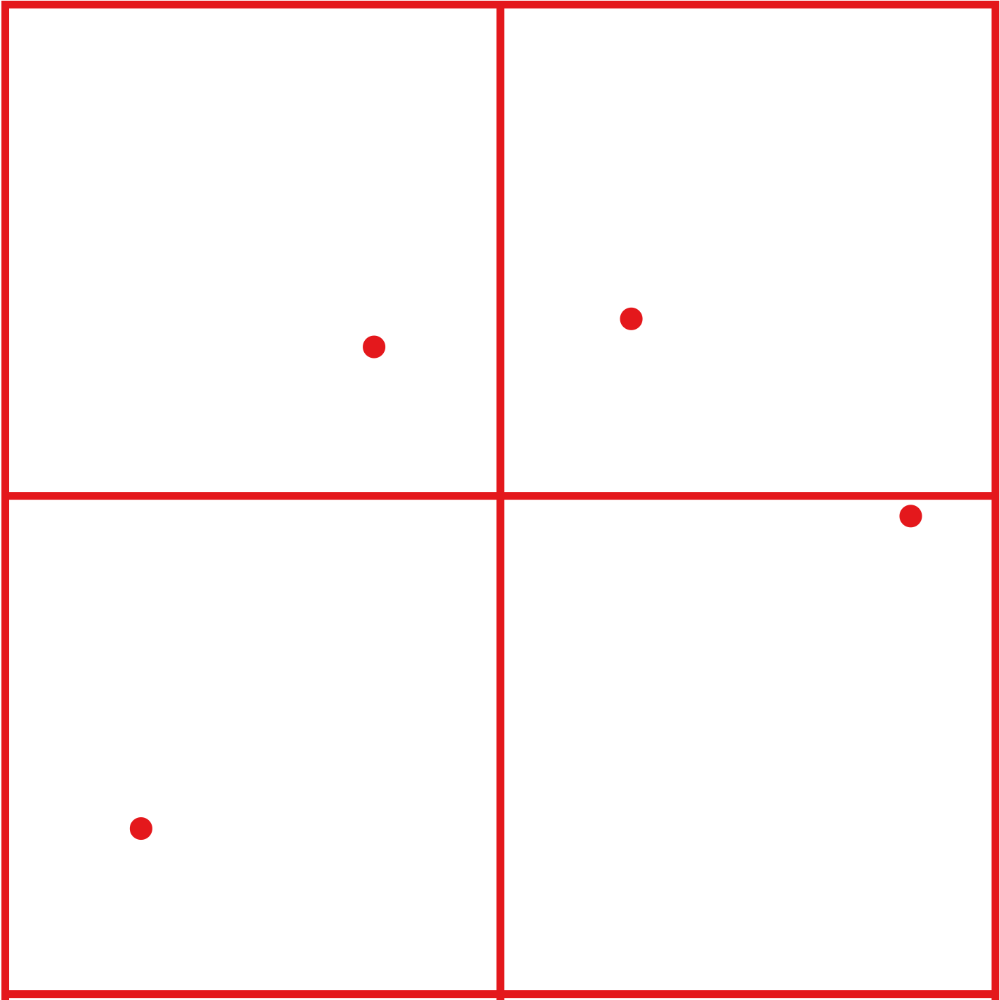
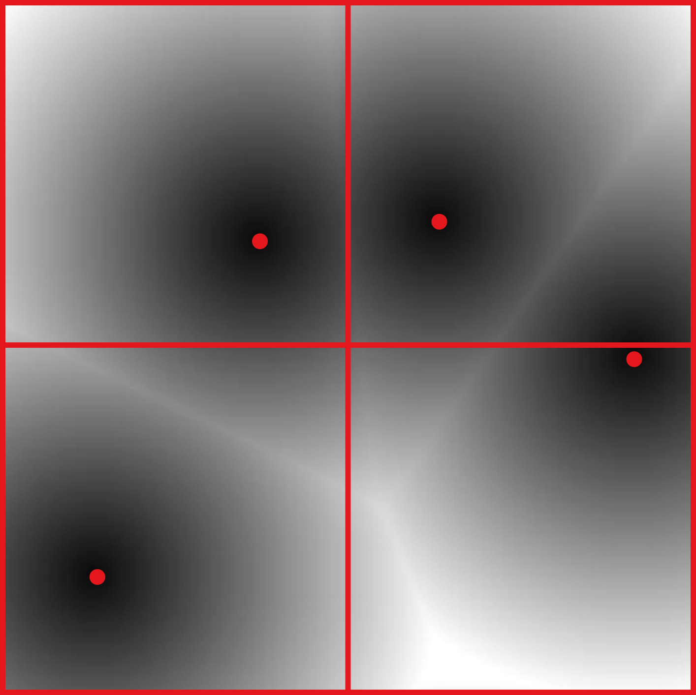
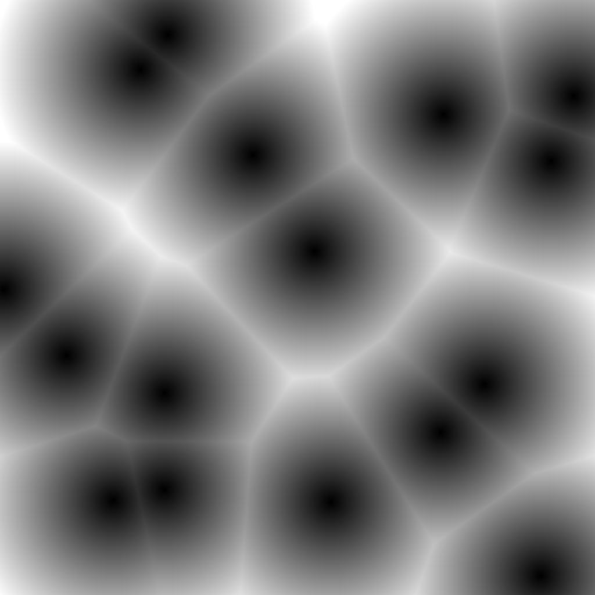
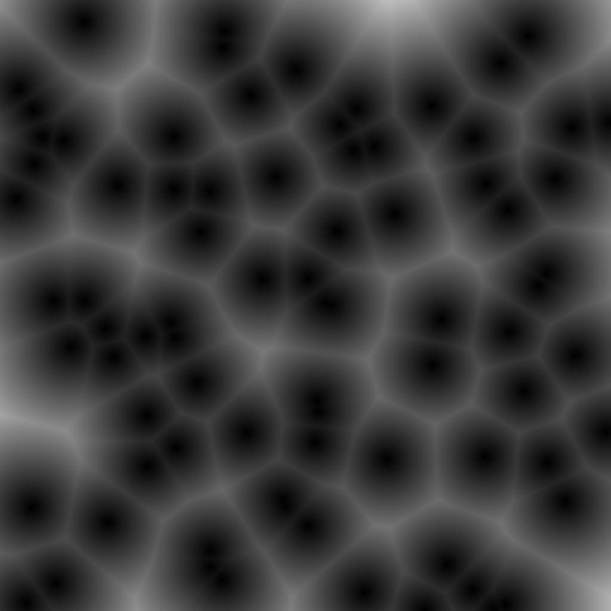
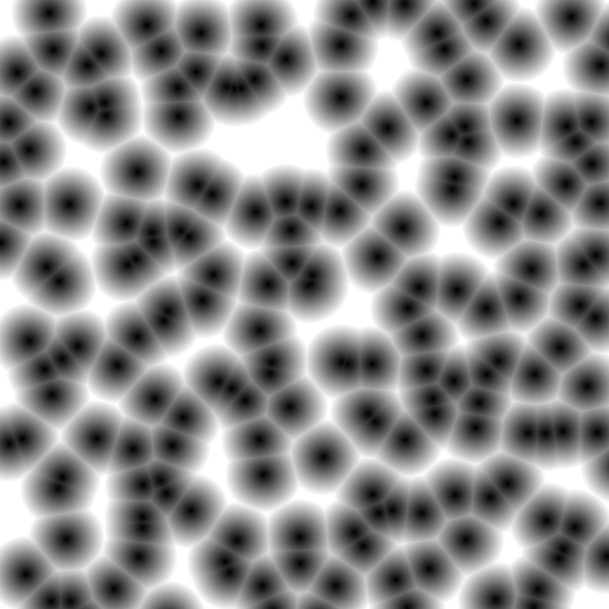
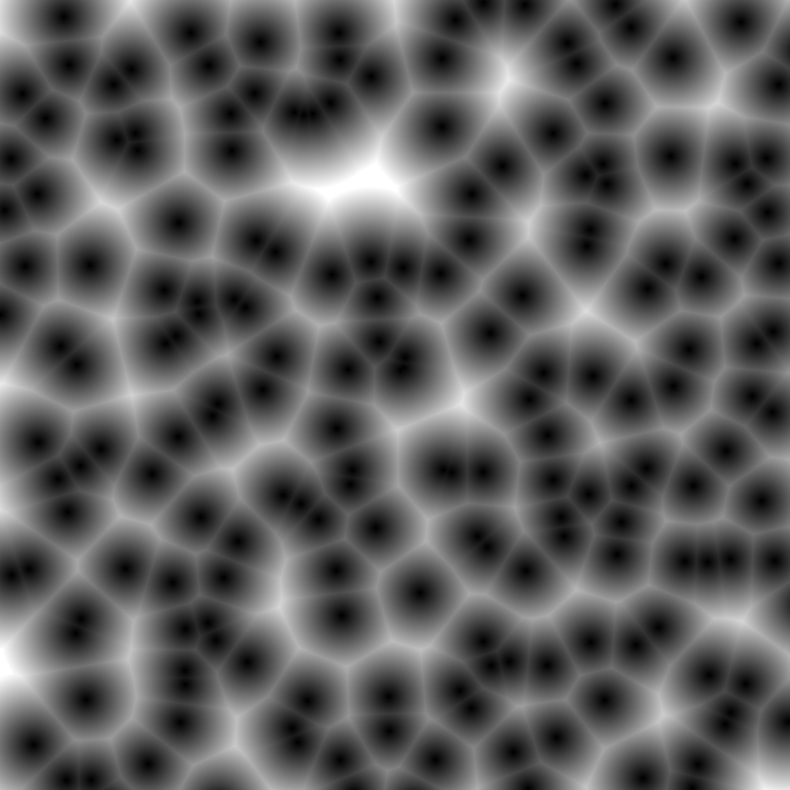
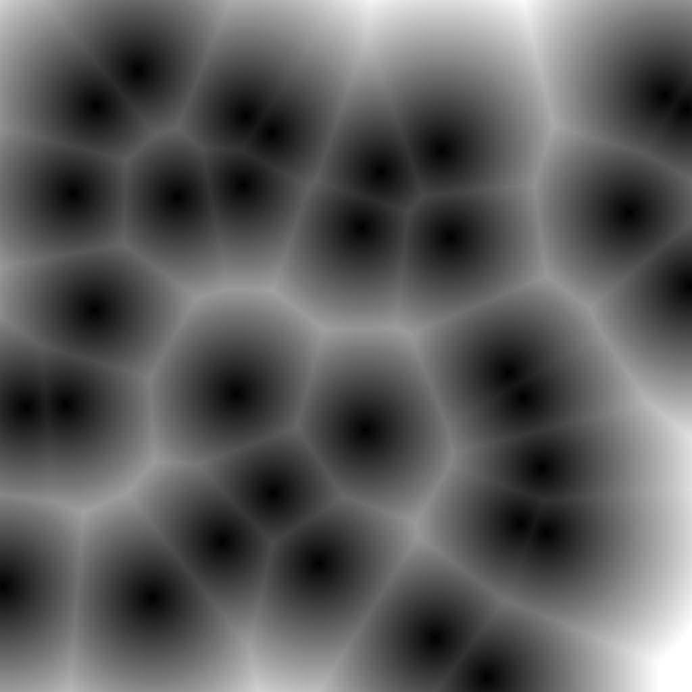
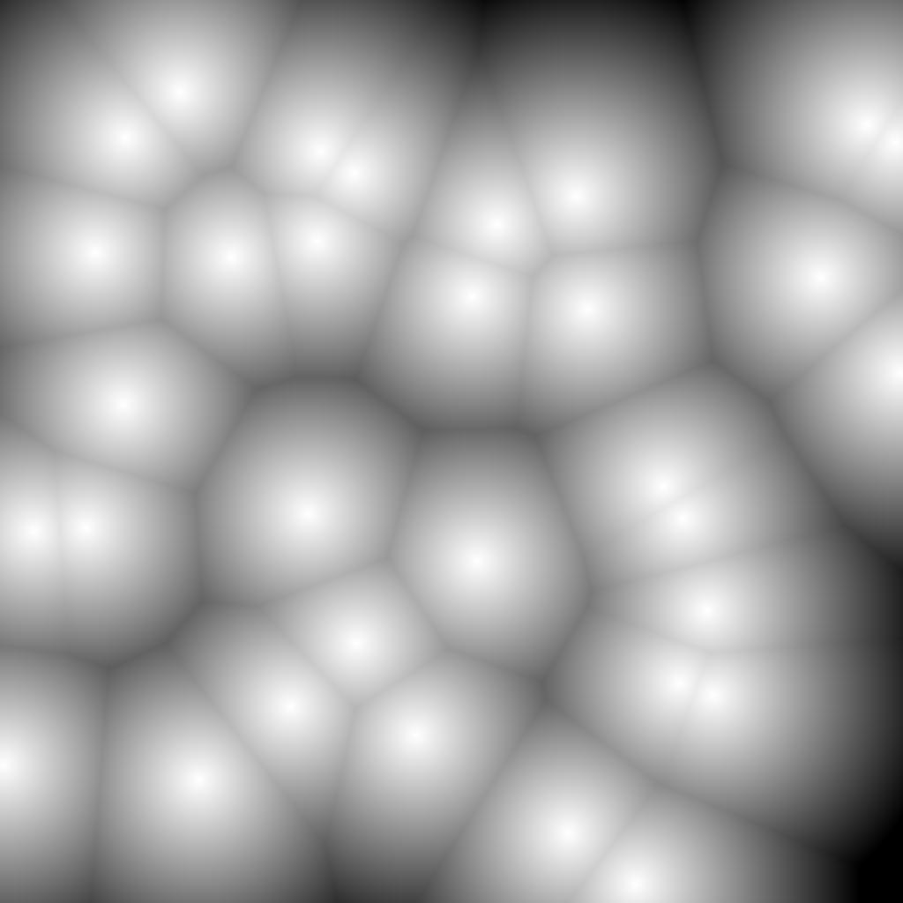

# Worley Noise

This project includes a serial and a parallel implementation of the Worley Noise on GPU. The parallel version uses CUDA.

## What is Worley noise?
Worley noise, sometimes referred to as cell noise, is used to add details to the surface of rendered objects [[1]](http://weber.itn.liu.se/~stegu/TNM084-2017/worley-originalpaper.pdf), a process known as procedural texturing. It can be used to create textures resembling stone, water, ice, intestines, crumpled paper, mountain ranges, cell noise,  crocodile skin and clouds.

## How is Worley noise computed?

The basic principle of the Worley noise algorithm initially involves taking random fixed points in a space. This project only focuses on 2-dimensional space, although 3-dimensional space is also possible. Then, for every point, 
 ,  in the  plane, the distance to the th closest fixed point is calculated, . The distance is then normalized to create a shade of grey. The figures below show how 4 random points are transformed into Worley noise. The tiling (red boxed) are used as an optimizations as suggested by Rosén [[2]](http://www.carljohanrosen.com/share/CellNoiseAndProcessing.pdf).

Random points | Noise from random points
:-------------------------:|:-------------------------:
  |  

## Example outputs

1 Pixel/Tile | 5 Pixels/Tile
:-------------------------:|:-------------------------:
  |  

Intensity = 1 | Intensity = 1.5
:-------------------------:|:-------------------------:
 | 

Normal | Reverse
:-------------------------:|:-------------------------:
 | 

## Performance

The serial implementation was tested on an Intel Core i7-7700HQ. The parallel implementation used these two GPUs: NVIDIA GeForce GTX1050 and NVIDIA TITAN Black.

The table below shows the average timings (outputted using the `--performance` flag) for a 7000x7000 image using tiles of size 512x512 pixels. 
| | 32 points/tile | 64 points/tile | 96 points/tile |
| :------------ |:-------------:| :-----:| :---: |
| Serial [Intel i7-7700HQ]  | 33.45s | 68.91s | 95.42s |
| Parallel – Initial [GTX1050] | 1.13s | 2.25s | 3.31s |
| Parallel – Optimized [GTX1050] | 1.06s | 2.16s | 3.18s |
| Parallel – Optimized [TITAN Black]  | 0.45s | 0.84s | 1.38s |

The speedups (compared to the serial implementation) for the same configurations, are shown below.

| | 32 points/tile | 64 points/tile | 96 points/tile |
| :------------ |:-------------:| :-----:| :---: |
| Parallel – Initial [GTX1050] | x29.5 | x30.7 | x38.8 |
| Parallel – Optimized [GTX1050] | x31.7 | x32.1 | x30.9 |
| Parallel – Optimized [TITAN Black] | x74.3 | x82.6 | x84.3 |

## Running the program

This project is built and packaged using __Nsight Eclipse__ version __9.2__ & Cuda version 10.2.

There are three build configurations: Release, Debug and Tests.

To run this project outside an Nsight environment, run `make` inside the `/Demo` folder to get an executable file.

## Licence

Worley Noise GPU is distributed under the GPL-3.0 licence.

## Credits

JButil for PGM image processing.  
[GMP](https://gmplib.org/) for the serial arithmetic library.