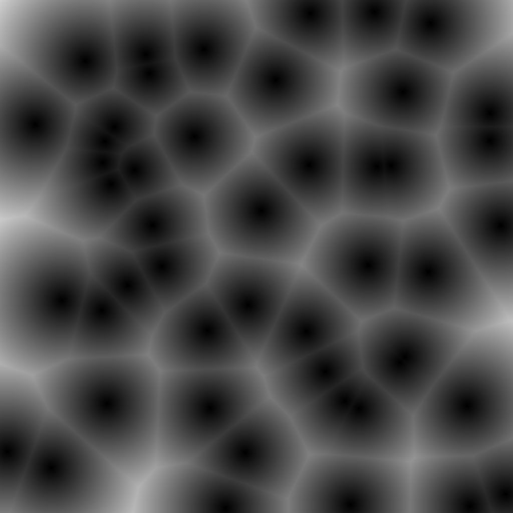
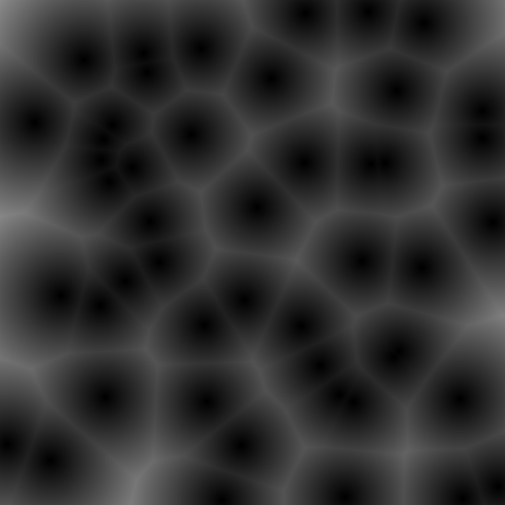

# Worley-Noise-GPU
A parallel implementation of the Worley Noise on GPU

Pixels per tile
1 Pixel/Tile | 5 Pixels/Tile
:-------------------------:|:-------------------------:
  |  

Intensity = 1 | Intensity = 1.5
:-------------------------:|:-------------------------:
 | 

Normal | Reverse
:-------------------------:|:-------------------------:
 | 
